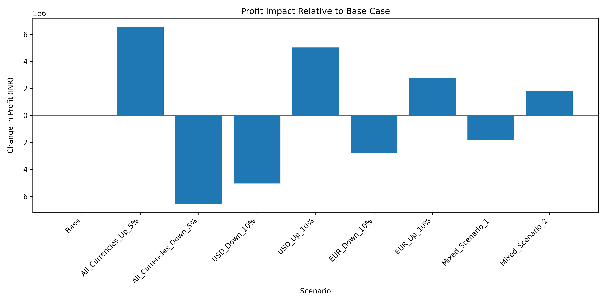
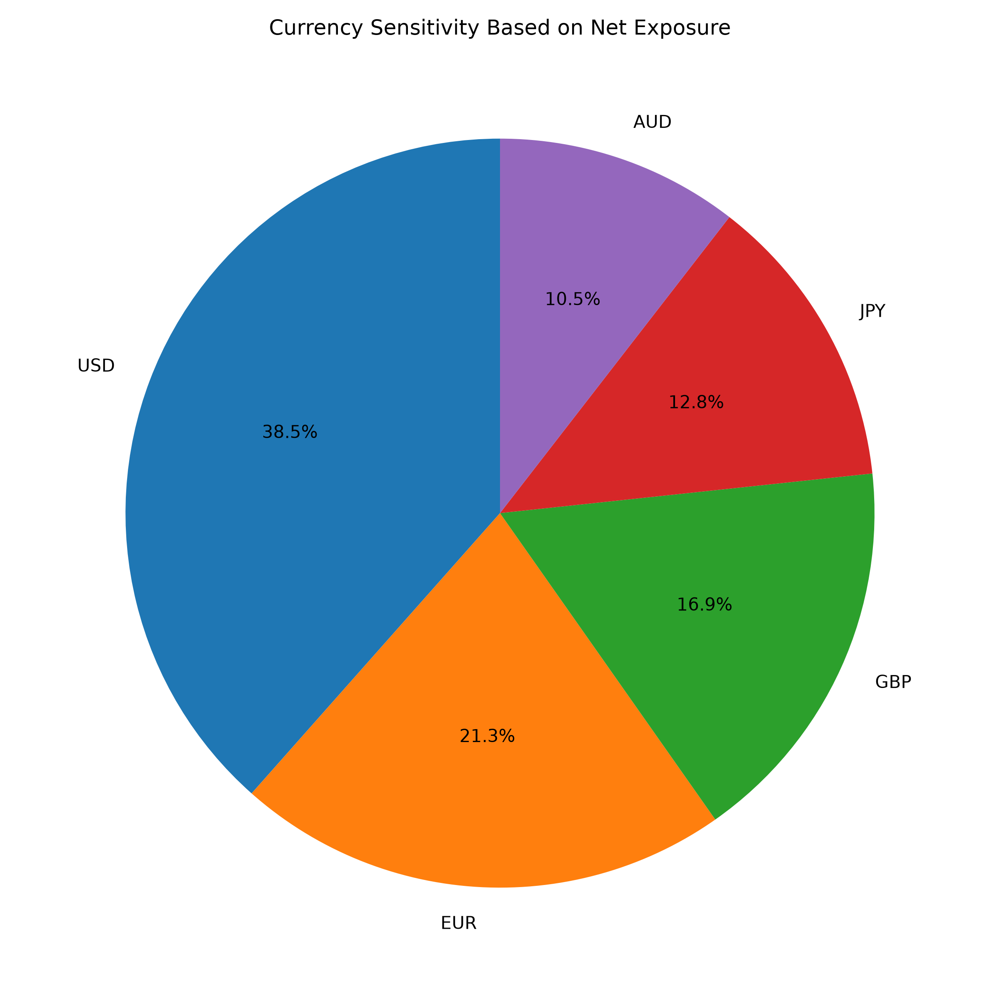

# Currency Exposure & Risk Simulator

A Python-based financial analysis project that studies how foreign-currency exposure can affect a company's revenue, expenses, and profit when exchange rates change.

The project uses **Pandas** for financial data processing and **Matplotlib** for visual analysis.

## What the Project Does

The program:

* Converts foreign-currency revenue and expenses into INR
* Calculates total revenue, expenses, and profit
* Calculates net exposure for each currency
* Measures each currency's share of total exposure
* Simulates multiple exchange-rate scenarios
* Calculates the resulting profit under each scenario
* Compares simulated profits against the Base Case
* Visualizes profit impact and currency sensitivity

## Technologies Used

* Python
* Pandas
* Matplotlib

## Input Data

### `data.csv`

Contains the company's revenue, expenses, currencies, and exchange rates.

### `simulation.csv`

Contains different exchange-rate scenarios, including:

* Base Case
* All currencies up/down
* Individual currency movements
* Mixed currency scenarios

## Visualizations

### Profit Impact

Shows how each simulated scenario changes total profit relative to the Base Case.

### Currency Sensitivity

Shows the relative contribution of each currency to the company's net currency exposure.

## Key Concepts

This project demonstrates practical applications of:

* Pandas DataFrames
* CSV data processing
* Financial calculations
* Currency exposure analysis
* Scenario analysis
* Sensitivity analysis
* Data visualization
